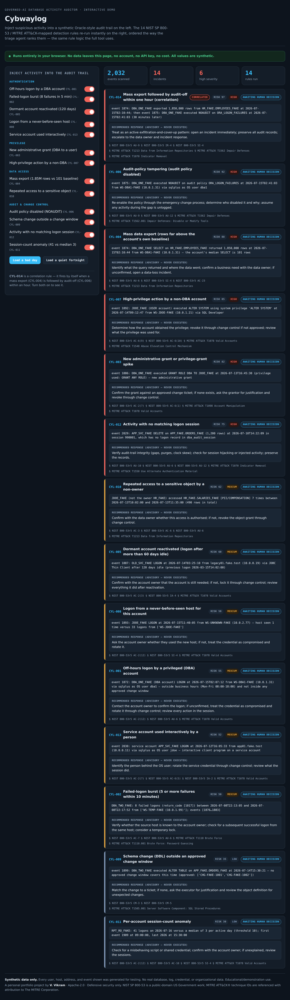
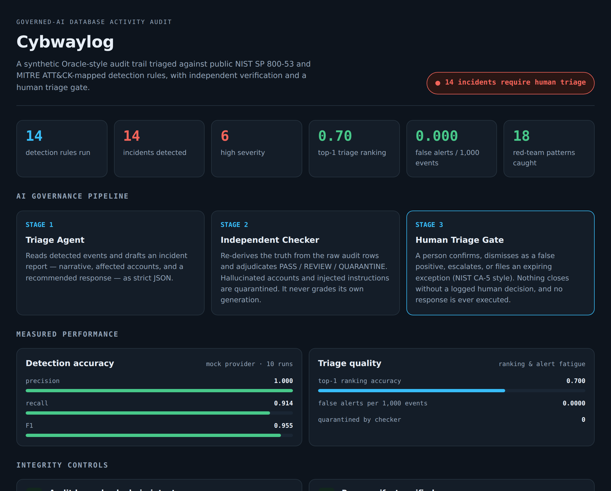

<h1 align="center">Cybwaylog</h1>

<p align="center"><b>An open-source, governed-AI database <i>activity</i> auditor.</b><br>
AI triages a database's audit trail for insider-threat and misuse patterns, checks it against public
NIST&nbsp;SP&nbsp;800-53 and MITRE&nbsp;ATT&amp;CK-mapped detection rules, and drafts incident reports with a
recommended response — under independent verification, a human triage gate, and a tamper-evident audit log.</p>

<p align="center">


</p>

<p align="center"><i>A personal AI-engineering portfolio project by V. Vikram — the activity-auditing sibling of
<a href="https://github.com/eagles777/cybwaydb">Cybwaydb</a>.</i></p>

---

## See it in action

Inject suspicious activity into a synthetic audit trail and watch all 14 detection rules re-run live —
**entirely in the browser, no API key, no cost.** ([`docs/demo.html`](docs/demo.html))



The tool also produces a self-contained HTML incident-timeline report:



## Why it's different

Cybwaydb asks *"is this database configured securely?"* (static state). **Cybwaylog asks *"is anything
suspicious happening in it?"* (dynamic behavior).** Together they cover both halves of database assurance.

Commercial SIEM/UEBA platforms are closed and their AI is opaque. Cybwaylog is open-source,
CI/CD-native, and publishes its own governance architecture *and* its AI accuracy — including two
metrics that decide whether AI triage is actually usable: **does it rank the worst incident first**,
and **how many false alerts does it generate per 1,000 events**.

## The governance architecture

Every AI claim is re-verified against the raw audit rows, and nothing closes without a logged human decision.

```
  synthetic audit trail
          │
          ▼
  ┌───────────────────┐   ┌──────────────────────┐   ┌─────────────────────┐
  │ 1 · Triage Agent  │──▶│ 2 · Independent      │──▶│ 3 · Human Triage    │
  │ drafts incident   │   │     Checker          │   │     Gate            │
  │ + recommended     │   │ re-derives truth,    │   │ confirm / dismiss / │
  │ response (JSON)   │   │ PASS·REVIEW·QUARANTINE│  │ escalate / except.  │
  └───────────────────┘   └──────────────────────┘   └─────────────────────┘
                                     │                          │
                                     ▼                          ▼
                        18 OWASP LLM Top-10 patterns    tamper-evident
                        + injection canary quarantined  hash-chained log
```

The checker **never grades its own generation** — it re-derives ground truth from the raw rows.
There is **no execute path** anywhere in the codebase: recommended responses are advisory only.

## Published AI accuracy

Measured against deterministic ground truth (the rule engine on the same synthetic trail).

| Metric | Mock provider (50 runs, seed 42) | What it means |
|---|---|---|
| Precision | **0.998** | of everything flagged, virtually all was real |
| Recall | **0.896** | of all real incidents, ~90% were caught |
| F1 | **0.944** | balance of the two |
| Top-1 ranking accuracy | **0.78** | how often the worst incident is ranked #1 |
| False alerts / 1,000 events | **0.0098** | alert-fatigue rate over 2,032 events per run |

**Live-model results: none yet.** These are mock-harness numbers that validate the measurement
pipeline itself. See [`BENCHMARKS.md`](BENCHMARKS.md) and the
[NIST AI RMF control mapping](docs/NIST_AI_RMF_MAPPING.md).

## What's inside

**14 detection rules**, each citing NIST SP 800-53 controls and MITRE ATT&CK technique IDs, with
evidence built only from raw rows and an advisory response:

| Rule | Detection | Severity |
|---|---|---|
| CYL-001 | Off-hours logon by a privileged (DBA) account | medium |
| CYL-002 | Failed-logon burst (≥5 failures in 10 minutes) | medium |
| CYL-003 | New administrative grant or privilege-grant spike | high |
| CYL-004 | Mass data export (rows far above the account's baseline) | high |
| CYL-005 | Dormant account reactivated (>60 days idle) | medium |
| CYL-006 | Audit-policy tampering (policy disabled) | high |
| CYL-007 | High-privilege action by a non-DBA account | high |
| CYL-008 | Logon from a never-before-seen host | medium |
| CYL-009 | Schema change (DDL) outside an approved change window | low |
| CYL-010 | Repeated access to a sensitive object by a non-owner | medium |
| CYL-011 | Per-account session-count anomaly | low |
| CYL-012 | Activity with no matching logon session | high |
| CYL-013 | Service account used interactively by a person | medium |
| CYL-014 | Mass export followed by audit-off within an hour (**correlation**) | high |

Plus: synthetic 14-day activity generator with seeded incidents and an **injection canary**;
triage + independent checker agents; human gate with **expiring** NIST CA-5-style exceptions;
tamper-evident hash-chained audit log + SHA-256 manifest; 18-pattern OWASP LLM red-team suite;
eval benchmark; HTML timeline report; policy-lint + secret-scan controls; **156 tests**, $0 CI.

## See the correlation rule work — one command

```bash
python examples/insider_threat_walkthrough.py
```

Starts from a clean two-week trail (**zero detections**), injects three hand-written rows — an
off-hours DBA logon, a 1.2M-row export of a salary table, and logon auditing switched off 22 minutes
later — and re-scans. Each signal is explainable alone; together they rank **CYL-014 first**, above
the individually-severe events that compose it. Offline, no key, ~2 seconds. Its claims are asserted
in `tests/test_walkthrough.py`, so the demo cannot drift from what the rules actually do.

## Quick start

```bash
pip install -e ".[dev]"
pytest                                        # 156 tests, all offline, $0

cybwaylog init-log --out mylog.sqlite         # export a synthetic trail you can edit
cybwaylog scan --db mylog.sqlite --out runs/latest   # scan your own trail
cybwaylog scan --out runs/latest              # or scan the built-in synthetic trail
cybwaylog scan --clean --out runs/quiet       # a quiet fortnight → zero detections

cybwaylog report --run-dir runs/latest --out report.html   # standalone HTML timeline
cybwaylog verify --run-dir runs/latest        # verify hash chain + manifest
cybwaylog benchmark --runs 50 --seed 42       # precision/recall/ranking/alert-fatigue
cybwaylog redteam                             # prove the injection canary is caught
cybwaylog controls --root .                   # policy-lint + secret-scan the repo
```

Everything runs in **mock mode by default** — no API key, no network, no cost. CI runs mock mode only.

## Safety &amp; scope

- **Defensive only.** No offensive/exploit code. "Red-team" here means self-testing our own tool
  against published OWASP LLM Top 10 patterns.
- **Synthetic data only.** Every user, host, address, and event was generated for testing. No real
  database, log, credential, or organizational data.
- **No execute path.** Recommended responses are advisory; `dry_run_response()` always reports
  `executed=False`, and nothing resolves without a logged human decision.
- **Zero-spend by policy.** The budget ceiling defaults to `$0.00` and is checked *before* any call;
  a live run requires a free-tier key with no billing attached, and an exhausted quota stops the run
  rather than falling back to anything paid.
- Only event *metadata* would ever be sent to a model — never free-text fields, never credentials.
- See [`LEGAL.md`](LEGAL.md) for licensing and source-material provenance.

## License

Apache-2.0 — see [`LICENSE`](LICENSE) and [`NOTICE`](NOTICE). Copyright © V. Vikram.
